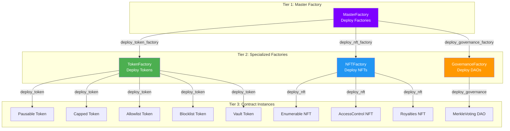
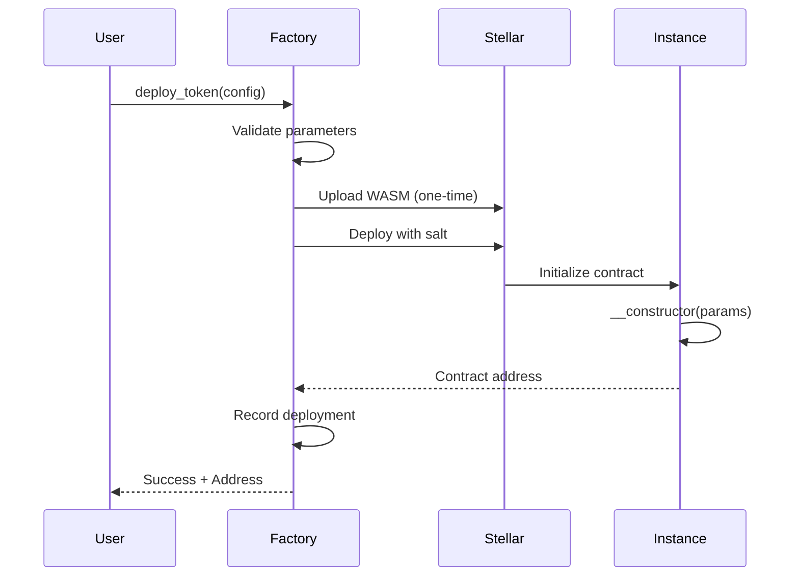

<div align="center">


# Stellar Studio Contracts

**Deploy and command Stellar tokens, NFTs, and DAOs through conversation.**

Production-ready Soroban blueprints powering our conversational factory system for tokens, NFTs, and governance on Stellar.

[](LICENSE)
[](https://stellar.org)
[](https://www.rust-lang.org/)

[Quick Start](#quick-start) • [Architecture](#architecture) • [Contracts](#contracts) • [Deployment](#deployment)

</div>

---

## Overview

Stellar Studio Contracts is a comprehensive suite of production-ready Soroban smart contracts implementing the factory pattern for efficient deployment and post-deployment control. Built with Rust and OpenZeppelin Stellar libraries, the system enables programmatic deployment of tokens, NFTs, and governance contracts—and the on-chain operations they require—on the Stellar network.

**What's Included:**
- 4 Factory Contracts (Master, Token, NFT, Governance)
- 5 Token Contract Types (Pausable, Capped, Allowlist, Blocklist, Vault)
- 3 NFT Contract Types (Enumerable, Royalties, AccessControl)
- 1 Governance System (MerkleVoting)
- Auto-generated TypeScript clients for all contracts

---

## Table of Contents

- [Architecture](#architecture)
- [Contracts](#contracts)
  - [Factory System](#factory-system)
  - [Token Contracts](#token-contracts)
  - [NFT Contracts](#nft-contracts)
  - [Governance](#governance)
- [Quick Start](#quick-start)
- [Building](#building)
- [Testing](#testing)
- [Deployment](#deployment)
- [TypeScript Integration](#typescript-integration)

---

## Architecture

### Factory Pattern System

The contracts implement a three-tier factory architecture for efficient contract deployment:




### Deployment Flow



### Benefits

**Gas Efficiency**: Upload WASM once, deploy unlimited instances with minimal cost

**Version Control**: Update contract logic without redeploying existing instances

**Discoverability**: Query all deployed contracts from factory

**Standardization**: Consistent deployment patterns across all contract types

---

## Contracts

### Factory System

#### MasterFactory

Top-level factory that deploys other factories.

**Key Functions:**
- `deploy_token_factory(admin)` - Deploy new TokenFactory
- `deploy_nft_factory(admin)` - Deploy new NFTFactory
- `deploy_governance_factory(admin)` - Deploy new GovernanceFactory
- `get_deployed_factories()` - List all factory addresses

**TypeScript Package:** `packages/master_factory`

---

#### TokenFactory

Deploys fungible token contracts with various access control mechanisms.

**Supported Types:**
- **Pausable** - Emergency pause/unpause functionality
- **Capped** - Maximum supply enforcement
- **Allowlist** - Whitelist-only token holders
- **Blocklist** - Blacklist prohibited addresses
- **Vault** - Time-locked asset custody

**Key Functions:**
- `deploy_token(deployer, config)` - Deploy token contract
- `get_deployed_tokens()` - List all deployed tokens
- `get_tokens_by_type(type)` - Filter by token type
- `get_tokens_by_admin(admin)` - Filter by admin
- `get_token_count()` - Total deployment count

**TypeScript Package:** `packages/token_factory`

---

#### NFTFactory

Deploys ERC-721 compatible NFT collection contracts.

**Supported Types:**
- **Enumerable** - Full token enumeration with index queries
- **AccessControl** - Role-based permission system
- **Royalties** - EIP-2981 royalty standard (exists but not exposed in frontend)

**Key Functions:**
- `deploy_nft(deployer, config)` - Deploy NFT collection
- `get_deployed_nfts()` - List all NFT collections
- `get_nfts_by_type(type)` - Filter by NFT type
- `get_nfts_by_owner(owner)` - Filter by owner
- `get_nft_count()` - Total deployment count

**TypeScript Package:** `packages/nft_factory`

---

#### GovernanceFactory

Deploys DAO governance contracts for on-chain voting.

**Supported Types:**
- **MerkleVoting** - Gas-efficient voting with Merkle proofs

**Key Functions:**
- `deploy_governance(deployer, config)` - Deploy governance contract
- `get_deployed_governance()` - List all governance contracts
- `get_governance_by_type(type)` - Filter by type
- `get_governance_by_admin(admin)` - Filter by admin

**TypeScript Package:** `packages/governance_factory`

---

### Token Contracts

<details>
<summary><b>Fungible Pausable Token</b></summary>

Emergency pause functionality for transfers.

**Features:**
- Pause/unpause all token transfers
- Admin-only pause control
- Standard ERC-20 operations

**Constructor:**
```rust
__constructor(admin, manager, initial_supply, name, symbol, decimals)
```

**Key Methods:**
- `pause(caller)` - Pause all transfers
- `unpause(caller)` - Resume transfers
- `paused()` - Check pause status
- `transfer(from, to, amount)` - Transfer tokens
- `mint(account, amount)` - Mint new tokens

**Package:** `packages/fungible_pausable_example`

</details>

<details>
<summary><b>Fungible Capped Token</b></summary>

Fixed maximum supply enforcement.

**Features:**
- Hard cap on total supply
- Prevents minting beyond cap
- Immutable cap set at deployment

**Constructor:**
```rust
__constructor(admin, manager, initial_supply, cap, name, symbol, decimals)
```

**Key Methods:**
- `mint(account, amount)` - Mint tokens (respects cap)
- `total_supply()` - Current supply
- Standard ERC-20 operations

**Package:** `packages/fungible_capped_example`

</details>

<details>
<summary><b>Fungible Allowlist Token</b></summary>

Whitelist-only token access.

**Features:**
- Only allowed addresses can hold tokens
- Admin-managed allowlist
- KYC/AML compliance support

**Constructor:**
```rust
__constructor(admin, manager, initial_supply, name, symbol, decimals)
```

**Key Methods:**
- `allow_user(admin, user)` - Add to allowlist
- `disallow_user(admin, user)` - Remove from allowlist
- `allowed(user)` - Check if user is allowed
- Standard ERC-20 operations with allowlist checks

**Package:** `packages/fungible_allowlist_example`

</details>

<details>
<summary><b>Fungible Blocklist Token</b></summary>

Blacklist prohibited addresses.

**Features:**
- Block specific addresses from receiving tokens
- Admin-managed blocklist
- Sanctions compliance

**Constructor:**
```rust
__constructor(admin, manager, initial_supply, name, symbol, decimals)
```

**Key Methods:**
- `block_user(admin, user)` - Add to blocklist
- `unblock_user(admin, user)` - Remove from blocklist
- `blocked(user)` - Check if user is blocked
- Standard ERC-20 operations with blocklist checks

**Package:** `packages/fungible_blocklist_example`

</details>

<details>
<summary><b>Fungible Vault Token</b></summary>

Time-locked asset custody with ERC-4626 pattern.

**Features:**
- Wraps underlying assets
- Share-based accounting
- Deposit/withdrawal operations

**Constructor:**
```rust
__constructor(asset, decimals_offset)
```

**Key Methods:**
- `deposit(amount, receiver)` - Deposit assets
- `withdraw(shares, receiver)` - Withdraw assets
- `total_assets()` - Total managed assets

**Package:** `packages/fungible_vault_example`

</details>

---

### NFT Contracts

<details>
<summary><b>NFT Enumerable</b></summary>

Full token enumeration with ERC-721 compatibility.

**Features:**
- Track all tokens by index
- Query tokens by owner with pagination
- Global token index

**Constructor:**
```rust
__constructor(owner)
```

**Key Methods:**
- `mint(to)` - Mint new NFT
- `total_supply()` - Total minted NFTs
- `get_token_id(index)` - Get token ID by global index
- `get_owner_token_id(owner, index)` - Get token ID by owner index
- Standard ERC-721 operations

**Package:** `packages/nft_enumerable_example`

</details>

<details>
<summary><b>NFT AccessControl</b></summary>

Role-based permission management for NFTs.

**Features:**
- Granular role-based permissions
- Multi-admin support
- Custom role creation

**Constructor:**
```rust
__constructor(admin)
```

**Key Methods:**
- `grant_role(admin, user, role)` - Grant role to user
- `revoke_role(admin, user, role)` - Revoke user role
- `has_role(user, role)` - Check if user has role
- Standard ERC-721 operations

**Package:** `packages/nft_access_control_example`

</details>

<details>
<summary><b>NFT Royalties</b></summary>

EIP-2981 compliant royalty information.

**Features:**
- Collection-wide default royalty (10%)
- Per-token royalty overrides
- On-chain royalty calculation
- ERC-721 compatible

**Constructor:**
```rust
__constructor(admin, manager)
```

**Key Methods:**
- `mint(to)` - Mint NFT with default royalty
- `mint_with_royalty(to, receiver, basis_points)` - Mint with custom royalty
- `get_royalty_info(token_id, sale_price)` - Calculate royalty
- `set_default_royalty(receiver, basis_points)` - Update default
- Standard ERC-721 operations

**Package:** `packages/nft_royalties_example`

**Note:** Contract exists but not currently exposed in frontend

</details>

---

### Governance

<details>
<summary><b>MerkleVoting Governance</b></summary>

Gas-efficient on-chain voting with Merkle proof verification.

**Features:**
- Merkle tree-based voter verification
- Weighted voting support
- On-chain vote tallying
- Transparent results

**Constructor:**
```rust
__constructor(root_hash)
```

**Key Methods:**
- `vote(vote_data, proof, approve)` - Cast vote with Merkle proof
- `has_voted(index)` - Check if voter has voted
- `get_vote_results()` - Get current vote tallies

**Package:** `packages/merkle_voting`

</details>

---

## Quick Start

### Prerequisites

- [Rust](https://www.rust-lang.org/tools/install) 1.79+
- [Stellar CLI](https://developers.stellar.org/docs/tools/developer-tools)
- [Docker](https://www.docker.com/) (for local network)
- [Node.js](https://nodejs.org/) 22+ (for TypeScript packages)

### Installation

```bash
# Clone repository
git clone https://github.com/Scaffold-Studio/Stellar-Studio-Contracts.git
cd Stellar-Studio-Contracts

# Build all contracts
stellar contract build

# Generate TypeScript clients
npm run build:clients
```

### Deploy to Testnet

<details>
<summary><b>Testnet Deployment Guide</b></summary>

```bash
# 1. Create testnet identity
stellar keys generate me --network testnet

# 2. Fund account
stellar keys fund me --network testnet

# 3. Run setup script
./setup-testnet.sh
```

The script will:
- Build all contracts
- Upload WASM files to testnet
- Deploy all factories
- Initialize with WASM hashes
- Display all contract addresses

</details>

### Deploy to Local Network

<details>
<summary><b>Local Development Setup</b></summary>

```bash
# 1. Start local Stellar network
stellar network start local

# 2. Create identity
stellar keys generate me --network local

# 3. Fund account  
stellar keys fund me --network local

# 4. Run setup script
./setup-local.sh
```

**Important:** Local network resets when Docker restarts. Re-run `./setup-local.sh` after network resets.

</details>

---

## Building

### Build All Contracts

```bash
# Optimized WASM build
stellar contract build
```

Output location: `target/wasm32v1-none/release/*.wasm`

### Build TypeScript Clients

```bash
# Generate TypeScript packages for all contracts
npm run build:clients
```

Packages generated in: `packages/*/dist/`

### Build Single Contract

```bash
# Build specific contract
cd contracts/token-factory
stellar contract build
```

---

## Testing

### Run All Tests

```bash
# Run Rust unit tests
cargo test

# Run with output
cargo test -- --nocapture

# Test specific contract
cargo test --package token-factory
```

### Test Coverage

All factory contracts include comprehensive test suites covering:
- Constructor initialization
- WASM hash configuration
- Deployment validation
- Admin access control
- Upgrade mechanisms
- Emergency pause functionality

---

## Deployment

### Network Configurations

<details>
<summary><b>Local Network (Standalone)</b></summary>

```bash
# Network details
RPC: http://localhost:8000/rpc
Passphrase: Standalone Network ; February 2017

# Start network
stellar network start standalone

# Deploy
./setup-local.sh
```

**Note:** Contracts are lost when Docker container restarts. Redeploy after network resets.

</details>

<details>
<summary><b>Stellar Testnet</b></summary>

```bash
# Network details
RPC: https://soroban-testnet.stellar.org
Passphrase: Test SDF Network ; September 2015
Explorer: https://stellar.expert/explorer/testnet

# Deploy
./setup-testnet.sh
```

**Factory Addresses (Testnet):**
- Token Factory: `CAHLJEQUCNTV7JPAPCMLCBIHOX7FFB57DUARJ6XGTW27FPCVKKY7JM2A`
- NFT Factory: `CDJQAGTVOK37NPBWMADBJDGFYM6BEAFV4T45S23D4LQLGSTMRRZ5RQ6X`
- Governance Factory: `CC3SLHSCJHP7YJ462ZIACJ54VOHL5ZFUODZKBTITIZSO74D4YOPR5WCE`

</details>

<details>
<summary><b>Stellar Mainnet</b></summary>

**Pre-Deployment Checklist:**
- [ ] Professional security audit completed
- [ ] Comprehensive testnet testing done
- [ ] Multi-signature wallet configured
- [ ] Emergency procedures documented
- [ ] Monitoring infrastructure ready

```bash
# Network details
RPC: https://soroban-mainnet.stellar.org
Passphrase: Public Global Stellar Network ; September 2015
Explorer: https://stellar.expert/explorer/public

# Deploy (requires audit)
stellar contract deploy \
  --wasm target/wasm32v1-none/release/token_factory.wasm \
  --source-account mainnet-deployer \
  --network mainnet
```

</details>

---

## TypeScript Integration

### Generated Packages

All contracts have auto-generated TypeScript clients in `packages/`:

```typescript
// Import generated client
import { Contract as TokenFactory } from './packages/token_factory';

// Initialize client
const client = new TokenFactory({
  contractId: 'CAHLJEQUCNTV7JPAPCMLCBIHOX7FFB57DUARJ6XGTW27FPCVKKY7JM2A',
  networkPassphrase: 'Test SDF Network ; September 2015',
  rpcUrl: 'https://soroban-testnet.stellar.org',
  publicKey: walletAddress,
  signTransaction: async (xdr) => await wallet.signTransaction(xdr)
});

// Deploy token
const result = await client.deploy_token({
  deployer: walletAddress,
  config: {
    token_type: { tag: 'Pausable', values: undefined },
    admin: adminAddress,
    manager: managerAddress,
    initial_supply: '1000000',
    name: 'My Token',
    symbol: 'MTK',
    decimals: 7,
    salt: Buffer.from(randomSalt, 'hex'),
    cap: undefined,
    asset: undefined,
    decimals_offset: undefined
  }
});

await result.signAndSend();
```

### Package Contents

Each generated package includes:
- TypeScript type definitions
- Parameter validation
- Automatic XDR encoding/decoding
- Transaction simulation
- Error handling utilities

---

## Project Structure


```
stellar-studio-contracts/
├── contracts/                  # Rust smart contracts
│   ├── master-factory/         # MasterFactory
│   ├── token-factory/          # TokenFactory
│   ├── nft-factory/            # NFTFactory
│   ├── governance-factory/     # GovernanceFactory
│   ├── fungible-*/             # 5 token implementations
│   ├── nft-*/                  # 3 NFT implementations
│   └── merkle-voting/          # Governance implementation
│
├── packages/                   # Generated TypeScript clients
│   ├── master_factory/
│   ├── token_factory/
│   ├── nft_factory/
│   ├── governance_factory/
│   └── .../                    # Contract packages
│
├── target/                     # Build output
│   └── wasm32v1-none/release/  # Compiled WASM files
│
├── setup-local.sh              # Local network setup
├── setup-testnet.sh            # Testnet setup
├── DEPLOYMENT.md               # Deployment guide
└── QUICK_START.md              # Quick reference
```

---

## Security

### Smart Contract Security

- Built with OpenZeppelin Stellar audited libraries
- Soroban runtime provides memory safety
- Rust type system prevents common vulnerabilities
- Role-based access control on all admin functions
- Two-step admin transfers for ownership changes
- Emergency pause mechanisms on factories

### Development vs Production

**Development/Testnet:**
- Secret keys in `.env` acceptable (no real value)
- Used for testing and development only

**Production/Mainnet:**
- Never store secret keys in files
- Use hardware wallets or KMS
- Implement multi-signature for admin operations
- Conduct professional security audit
- Monitor contracts continuously

---

## Additional Resources

**Documentation:**
- [DEPLOYMENT.md](./DEPLOYMENT.md) - Detailed deployment instructions
- [QUICK_START.md](./QUICK_START.md) - Quick reference guide
- [Main README](../README.md) - Stellar Studio ecosystem overview

**Related Repositories:**
- [Stellar Studio Frontend](../stellar-studio-frontend/) - Web interface
- [Stellar Studio MCP Server](../stellar-studio-mcp-server/) - AI tools backend

**External Links:**
- [Stellar Documentation](https://developers.stellar.org/)
- [Soroban Smart Contracts](https://developers.stellar.org/docs/build/smart-contracts)
- [OpenZeppelin Stellar](https://github.com/OpenZeppelin/stellar-contracts)

---

## Contributing

Contributions welcome! Please follow these guidelines:

1. Fork the repository
2. Create feature branch (`git checkout -b feature/amazing-feature`)
3. Follow Rust API guidelines
4. Add tests for new features
5. Run `cargo fmt` and `cargo clippy`
6. Commit changes (`git commit -m 'feat: add amazing feature'`)
7. Push to branch
8. Open Pull Request

---

## License

MIT License - see [LICENSE](LICENSE) file for details.

---

<div align="center">

**Part of the Stellar Studio Ecosystem**

[Contracts](.) • [Frontend](../stellar-studio-frontend/) • [MCP Server](../stellar-studio-mcp-server/)

Built with Rust and Soroban for Stellar

</div>
